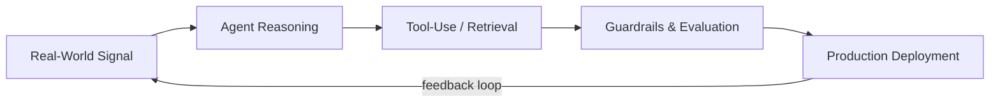

```
$ whoami
Sadiq Bandukda — AI Engineer building agentic systems that ship, not just demo.

$ status
Founder @ Rinqo (rinqo.ai) — AI voice agents answering real phone calls for real restaurants.
AI & Analytics ADP @ Trane Technologies — production LLM agents, RAG pipelines, multi-agent systems.

$ stack
Python · LangChain · LangGraph · Azure AI Foundry · RAG · Multi-Agent Orchestration · GCP · Docker
```

## What I'm Building

I build AI systems designed to operate autonomously in production, not just perform well in a demo. That means guardrails, evaluation, and failure analysis are part of the build, not an afterthought.



**Rinqo** — an AI voice agent platform I founded and built solo, answering restaurant phone calls 24/7, handling reservations, orders, and menu questions end to end.

**Natural Language-to-SQL Agent** — a production LLM agent on Azure AI Foundry with real security guardrails, generating safe queries against live production databases.

**AI-Powered Design of Experiments Platform** — a multi-agent system (co-pilot, extraction, confounding-advisor) coordinating on a shared blackboard to cut experiment planning from days to minutes.

## Tech Stack

     

## GitHub Stats


## Connect

[LinkedIn](https://www.linkedin.com/in/sadiq-bandukda-63593916a) · [rinqo.ai](https://rinqo.ai) · [Email](mailto:sadiq_bandukda@hotmail.com)


