```
$ whoami
Sadiq Bandukda — AI Engineer building agentic systems that ship, not just demo.

$ status
Founder @ Rinqo (rinqo.ai) — AI voice agents answering real phone calls for real restaurants.
AI & Analytics ADP @ Trane Technologies — production LLM agents, RAG pipelines, multi-agent systems.

$ stack
Python · LangChain · LangGraph · Azure AI Foundry · RAG · Multi-Agent Orchestration · GCP · Docker
```

## What I'm Building

I build AI systems designed to operate autonomously in production, not just perform well in a demo. That means guardrails, evaluation, and failure analysis are part of the build, not an afterthought.

```mermaid
flowchart LR
    A(["📡 Real-World Signal"]) --> B{{"🧠 Agent Reasoning"}}
    B --> C{{"🔍 Tool-Use / Retrieval"}}
    C --> D{{"🛡️ Guardrails & Evaluation"}}
    D --> E(["🚀 Production Deployment"])
    E -.->|"⚡ feedback loop"| A

    classDef signal fill:#0d0d0d,stroke:#00f0ff,stroke-width:3px,color:#00f0ff,font-weight:bold
    classDef agent fill:#0d0d0d,stroke:#ff00e6,stroke-width:3px,color:#ff00e6,font-weight:bold
    classDef guard fill:#0d0d0d,stroke:#00ff9d,stroke-width:3px,color:#00ff9d,font-weight:bold
    classDef deploy fill:#0d0d0d,stroke:#a020f0,stroke-width:3px,color:#a020f0,font-weight:bold

    class A signal
    class B,C agent
    class D guard
    class E deploy

    linkStyle 0 stroke:#00f0ff,stroke-width:2px
    linkStyle 1 stroke:#ff00e6,stroke-width:2px
    linkStyle 2 stroke:#00ff9d,stroke-width:2px
    linkStyle 3 stroke:#a020f0,stroke-width:2px
    linkStyle 4 stroke:#ffea00,stroke-width:2px,stroke-dasharray: 5 5
```



**Rinqo** — an AI voice agent platform I founded and built solo, answering restaurant phone calls 24/7, handling reservations, orders, and menu questions end to end.

**Natural Language-to-SQL Agent** — a production LLM agent on Azure AI Foundry with real security guardrails, generating safe queries against live production databases.

**AI-Powered Design of Experiments Platform** — a multi-agent system (co-pilot, extraction, confounding-advisor) coordinating on a shared blackboard to cut experiment planning from days to minutes.

## Tech Stack

**Languages**
  

**AI / LLMs**
     

**ML / Data Science**
    

**Data Visualization**
   

**AI App Frameworks**
   

**Cloud & DevOps**
   

**Data Engineering**
  

## Connect

[LinkedIn](https://www.linkedin.com/in/sadiq-bandukda-63593916a) · [rinqo.ai](https://rinqo.ai) · [Email](mailto:sadiq_bandukda@hotmail.com)


